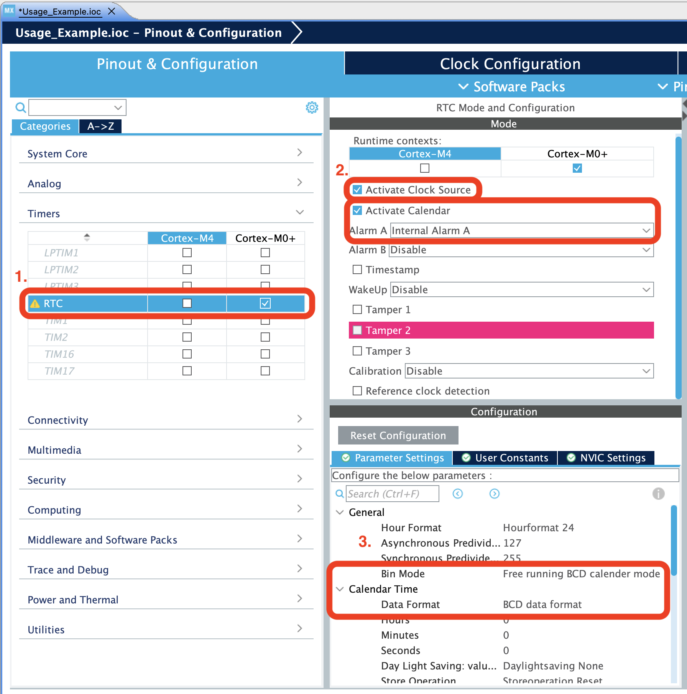
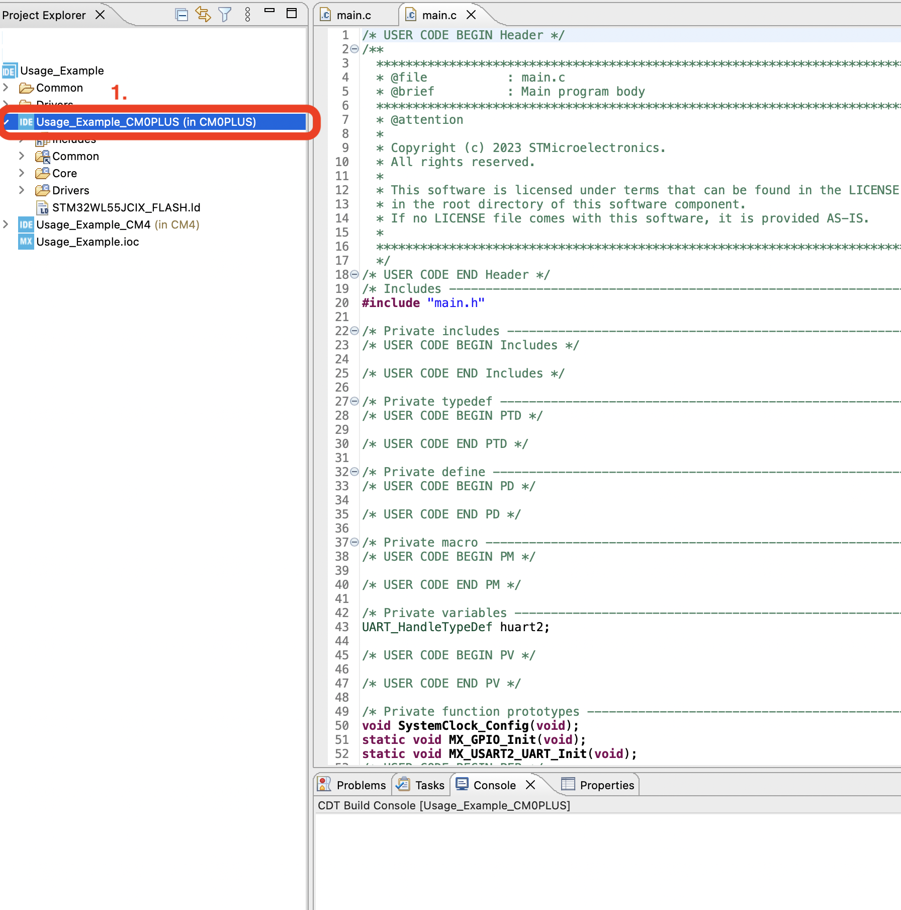
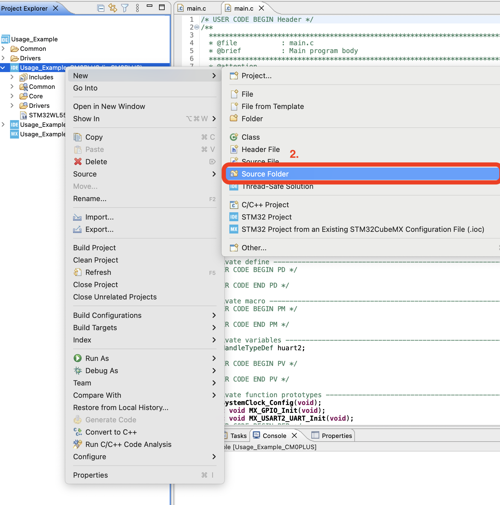

# STM32WL5x Calendar

The STM32WL5x Calendar software module adds event scheduling to the STM32WL5x MCU.  It is designed for use within an STM32CubeMX project for easy compatibility and use across projects.  The STM32WL5x Calendar provides a simple means to schedule events that could, for example, tell the MCU when to perform a task and how long to perform it for.

___

## Conceptual Design

The scheduler consists of two conceptual parts:  the RTC hardware peripheral used for time and date keeping and the software calendar of events scheduled.

The Calendar module consists of three conceptual parts: the RTC hardware peripheral used for keeping the time and date, the software calendar for storing a collection of events to execute, and the scheduler which ties the RTC and the software calendar together for execution of events.

At the heart of the module is the RTC hardware peripheral, which keeps the current time and date independent of the MCU's operations or power mode.  Along with keeping the current time and date, the RTC is capable of setting an alarm to fire once a specified time and day of the month has been reached.  The RTC is not capable of setting an alarm with a month or year, so this is handled by the scheduler.

Storage of events is taken care of by the software calendar.  Each event has a start time and date and an end time and date, and no more than one event can be in execution at once.  An event on its own is not very interesting unless it is paired with some other action outside of the module.  For this, each event provides the programmer with the option to register callback functions to execute upon the start and end of an event.

Finally, the scheduler brings the RTC and the software calendar together.  The scheduler manages event starting and ending by setting alarms in the RTC, executing event start and end callback functions, and supplements the RTC's lack of ability to set the month and year in it's alarms.

___

## Installation/Usage

To use the Calendar module add the provided directory to your STM32CubeMX project and include calender.h.

### STM32CubeMX Configuration

Before you can use the module the RTC must be enabled an configured.  The Calendar module expects the RTC to be configured in BCD mode with a 24 hour format, and for Alarm A to be enabled with an NVIC interrupt.

1. Open the STM32CubeMX configuration tool within your project and enable the RTC.
2. Enable the RTC's clock source and Alarm A.
3. Make sure that the RTC is set to run in BCD mode under General and Calendar Time, and 24 Hour format is set.
4. Go into the NVIC settings and enable Alarm A interrupts.

### Adding to Your STM32CubeMX Project

Now you are ready to add the module code.  Create a new source folder and add the module's header files to the compiler's include directory.

1. Right click on the sub-project for the core you want to use the module in.
2. Navigate to New > Source Folder.
3. Name the new Source Folder Modules.  Copy the Calendar folder into here.
4. Right click again on the same sub-project.  Navigate to Properties.
5. On the left side, navigate to C/C++ Build > Settings.
6. Within that window navigate to MCU GCC Compiler > Include Paths.
7. Add a new Include Path.
8. Enter "../Modules/Calendar/Inc".
9. Click Okay and exit the window.
10. Now include "calendar.h" in the file you want to use it within.

There appears to be a problem with the hardware and the STM32CubeMX auto-generated code on the Nucleo STM32WL55JC2 where the RTC's alarm can trigger once the NVIC is enables but before the HAL has been initialized for the RTC.  This causes the alarm interrupt flag to never be cleared and the IRQ is recalled indefinitely.  To fix this:

1. Within the sub-project that the RTC is initialized within (the same one used above) in the file explorer open the file Core > Src > stm32wlxx_hal_msp.c.
2. Find, copy, and comment out or remove the two lines within the *HAL_RTC_MspInit()* function:

    HAL_NVIC_SetPriority(RTC_LSECSS_IRQn, 0, 0);
    HAL_NVIC_EnableIRQ(RTC_LSECSS_IRQn);

3. Now open the file Core > Src > main.c and find the function *MX_RTC_Init()*.  At the bottom paste the two lines so that you have:

    /\* USER CODE BEGIN RTC_Init 2 \*/

    HAL_NVIC_SetPriority(RTC_LSECSS_IRQn, 0, 0);
    HAL_NVIC_EnableIRQ(RTC_LSECSS_IRQn);

    /\* USER CODE END RTC_Init 2 \*/

Any time that the STM32CubeMX auto-generates code (if you change configurations within the .ioc) step two will need to be repeated.

### Example Usage

A very simple usage example STM32CubeMX project is provided.  For a more interesting experience I have included an additional module called LED Debug.  All it does is provide some basic functionality to turn on and off the LEDs on the STM32WL55JC development board.  The example turns on the blue LED when an event starts, and turns it off when the event ends.  This can be seen in the following callback functions.

    /*
     * Function to execute once an event is entered.
     */
    void startEventCallback(void)
    {
        activate_led(BLUE_LED);
    }

    /*
     * Function to execute once an event is exited.
     */
    void endEventCallback(void)
    {
        deactivate_led(BLUE_LED);
    }
    
It is also necessary to call the *calendar_AlarmA_ISR()* function within the *HAL_RTC_AlarmAEventCallback()* function.  This lets the calendar scheduler know that the alarm triggered and the next alarm can be set.
    
    /*
     * Alarm A callback.
     */
    void HAL_RTC_AlarmAEventCallback(RTC_HandleTypeDef *hrtc)
    {
        // call ISR for handling calendar events
        calendar_AlarmA_ISR();
    }

Within the *main()* function, initialize the calendar module after the HAL has initialized the RTC.  The current date and time can be set too.

    // initialize the calendar module
    calendar_init(&hrtc);
    
    // set the date and time
    DateTime now = {23, 9, 29, 17, 0, 0};
    calendar_setDateTime(now);
    
Then add a few events to the calendar.  Notice the callback function registrations for each event's start and end.
    
    // create a few events five seconds apart from each other lasting two
    // seconds each
    CalendarEvent someEvents[3] = {
          [0] = {.start = {23, 9, 29, 17, 0, 5},
                  .end = {23, 9, 29, 17, 0, 7},
                  .start_callback = (void*)&startEventCallback,
                  .end_callback = (void*)&endEventCallback},
    
          [1] = {.start = {23, 9, 29, 17, 0, 10},
                  .end = {23, 9, 29, 17, 0, 12},
                  .start_callback = (void*)&startEventCallback,
                  .end_callback = (void*)&endEventCallback},
    
          [2] = {.start = {23, 9, 29, 17, 0, 15},
                  .end = {23, 9, 29, 17, 0, 17},
                  .start_callback = (void*)&startEventCallback,
                  .end_callback = (void*)&endEventCallback}
    };
    
    // add them to the calendar
    for (int i = 0; i < 3; i++)
      calendar_addEvent(someEvents[i]);
    
And finally start the calendar running.

    calendar_startScheduler();

Don't forget to update the calendar's scheduler in the main loop!

    while (1)
    {
        // update the calendar
        calendar_updateScheduler();
    }

___

## Notable Design Choices and Limitations

### Calendar Scheduler Updates (Entering and Exiting Events)

The TM32WL5x Calendar module has been designed to minimize actions with interrupts for more predictable behavior.  A single interrupt is used for the RTC alarm set for signaling the starting or ending of events, but handling of these event updates are performed outside of the interrupt by the *calendar_updateScheduler()* function.  As a consequence, event updates may be starved if the MCU's application cannot service it frequently enough, especially if event scheduling is on the order of only a few seconds.

If a more strict timing is needed the *calendar_updateScheduler()* can be called within the interrupt. However, to call *calendar_updateScheduler()* within the interrupt for the alarm, it must be called after *calendar_AlarmA_ISR()* and all event start and end callback functions must be non-blocking.  This is not recommended, nor tested, but is possible.

If two or more events overlap the scheduler takes a greedy approach.  Whichever event has an earlier start time will take precedence, and if two events start at the same time, the event first programmed in the calendar will take precedence.

Pausing the calendar keeps the scheduler within the state that is is at the time of the pause call.  The RTC will still fire an alarm to signal to the scheduler that an event has started/ended, but the scheduler will not perform the update.  If paused before an event enters, the event will not be entered unless unpaused while within the event's time span.  If unpaused after the event would have ended, then the event is missed completely.  Likewise, pausing within an event will keep the scheduler within that event until unpaused.

### Static Memory Usage

The calendar is allocated statically at compile time within an array and the size cannot be changed during execution.  The calendar array is managed into two linked lists, one for the events added and the other to keep memory locations that are unused.  The data structure at reset is as such:

| index | Event | Next Index |
| --- | --- | --- |
| 0 | EMPTY | 1 |
| 1 | EMPTY | 2 |
| 2 | EMPTY | 3 |
| 3 | EMPTY | 4 |
| 4 | EMPTY | 5 |
| 5 | EMPTY | 6 |
| 6 | EMPTY | -1 |

Additional indexes are kept :

| Used Head | Free Head |
| --- | --- |
| -1 | 0 |

Negative 1 is used to signal no next index.

After several events have been inserted the data structure may look like:

| index | Event | Next Index |
| --- | --- | --- |
| 0 | Event A | 1 |
| 1 | Event B | 2 |
| 2 | Event C | 3 |
| 3 | Event D | -2 |
| 4 | EMPTY | 5 |
| 5 | EMPTY | 6 |
| 6 | EMPTY | -1 |

| Used Head | Free Head |
| --- | --- |
| 0 | 4 |

Removing events puts them back on the front of the freed list.  After removing Event C:

| index | Event | Next Index |
| --- | --- | --- |
| 0 | Event A | 1 |
| 1 | Event B | 3 |
| 2 | EMPTY | 4 |
| 3 | Event D | -1 |
| 4 | EMPTY | 5 |
| 5 | EMPTY | 6 |
| 6 | EMPTY | -1 |

| Used Head | Free Head |
| --- | --- |
| 0 | 2 |

Inserting an event will maintain monotonic ordering of events using the event's start times as the sorting key.  Say Event E is inserted and starts before Event A:

| index | Event | Next Index |
| --- | --- | --- |
| 0 | Event A | 1 |
| 1 | Event B | 3 |
| 2 | Event E | 0 |
| 3 | Event D | -1 |
| 4 | EMPTY | 5 |
| 5 | EMPTY | 6 |
| 6 | EMPTY | -1 |

| Used Head | Free Head |
| --- | --- |
| 2 | 4 |

___

## Future Ideas

### Multiple Calendars

A second calendar may be easily implemented by altering the calendar module to keep a second static linked list of events and set alarms in the RTC's Alarm B.  Alarms can be kept to Alarm A if extra logic is added to check all calendars for the next alarm and keep track of which calendar's alarm is set.  This would also allow more than two calendars.

___

## API

### Return Codes

1. **CalendarStatus** - Status code returns from API function calls to signal if the call was successful or why the call was unsuccessful:
    - **CALENDAR_OKAY**  - API function call was successfully completed.
    - **CALENDAR_PARAMETER_ERROR** - API function call was given an invalid parameter.
    - **CALENDAR_NOT_INIT** - The Calendar module has not been initialized before API call.
    - **CALENDAR_FULL** - The calendar is full and cannot accept any more events.
    - **CALENDAR_PAUSED** - The calendar is paused.
    - **CALENDAR_RUNNING** - The calendar is running.

### Structures

1. **DateTime** - Structure to hold the date and time:
    - **year** - two digit 21st century year (0 - 99).
    - **month** - two digit month (1 - 12).
    - **day** - two digit day of month (1 - 28/29/30/31).
    - **hour** - two digit hour in 24 hour format (0 - 23).
    - **minute** - two digit minute (0 - 59).
    - **second** - two digit second (0 - 59).

3. **CalendarEvent** - Structure to hold the start and end DateTime and callback functions:
    - **start** - start DateTime of event.
    - **end** - end DateTime of event.
    - **start_callback** - callback function pointer for start of event.
    - **end_callback** - callback function pointer for end of event.

### Defines

1. MAX_NUM_EVENTS (event_sll.h) - sets the maximum number of events to allow within the calendar.

### Functions

1. **CalendarStatus calendar_init(RTC_HandleTypeDef\* hrtc)**  -  Initializes the calendar module.  Must be called before the module can operate.
    - Parameters:
        - **hrtc** - pointer to RTC_HandleTypeDef (HAL) handle of the RTC peripheral to be used.
    - Return:
        - **CALENDAR_OKAY** - if a pointer to an initialized HAL RTC handle was passed
        - **CALENDAR_PARAMETER_ERROR** - otherwise
    - Note:
        - Will not reinitialize if the module is already initialized.
2. **CalendarStatus calendar_resetEvents(void)** - Resets the event queue, clearing all events and stopping the calendar if running.
    - Return:
        - **CALENDAR_NOT_INIT** - if the calendar module has not been initialized
        - **CALENDAR_OKAY** - if successful
    - Note:
        - Will not reinitialize if the module is already initialized.
2. **CalendarStatus calendar_startScheduler(void)** - Starts execution of calendar events.  Will not start if the module has not been initialized.
    - Return:
        - **CALENDAR_NOT_INIT** - if the calendar module hasn't been initialized
        - **CALENDAR_RUNNING** - if the calendar is already running (not an error)
        - **CALENDAR_OKAY** - if the calendar was started
    - Note:
        - Starting the calendar is still successful if there are no events in the queue or if all events ended prior to the current RTC date and time.
4. **CalendarStatus calendar_pauseScheduler(void)** - Pauses execution of calendar events.  Will not start if the module has not been initialized.
    - Return:
        - **CALENDAR_NOT_INIT** - if the calendar module hasn't been initialized
        - **CALENDAR_PAUSED** - if the calendar is already paused (not an error)
        - **CALENDAR_OKAY** - if the calendar was paused
    - Note:
        - Pausing the calendar is still successful if there are no events in the queue or if the calendar is not within any events.  Pausing within an event will delay the end event callback function execution until the calendar is unpaused with calendar_start().  Events that would have started and completed while paused are skipped entirely.
5. **CalendarStatus calendar_setDateTime(const DateTime dateTime)** - Set the date and time of the RTC.
    - Parameters:
        - **dateTime** - the time and date to set the RTC to.
    - Return:
        - **CALENDAR_NOT_INIT** - if the calendar module hasn't been initialized
        - **CALENDAR_RUNNING** - if the calendar is not paused
        - **CALENDAR_OKAY** - if the calendar's date and time were set
    - Note:
        - Only sets time and date if the module has been initialized and has been paused.
6. **CalendarStatus calendar_getDateTime(DateTime\* const dateTime)** - Get the date and time of the RTC.
    - Parameters:
        - **dateTime** - pointer to a DateTime as a destination.
    - Return:
        - **CALENDAR_NOT_INIT** - if the calendar module hasn't been initialized
        - **CALENDAR_OKAY** - if the calendar's date and time were read
    - Note:
        - Only gets time and date if the module has been initialized.  Can get the time and date regardless of if the calendar is running or paused.
7. **CalendarStatus calendar_addEvent(const struct CalendarEvent event)** - Add a calendar event to the calendar.
    - Parameters:
        - **event** - pointer to CalendarEvent to copy event details from.
    - Return:
        - **CALENDAR_NOT_INIT** - if the calendar module hasn't been initialized
        - **CALENDAR_FULL** - if the calendar's queue is full
        - **CALENDAR_RUNNING** - if the calendar is not paused
        - **CALENDAR_OKAY** - if the event was successfully added
8. **CalendarStatus calendar_peekEvent(unsigned int id, CalendarEvent\* const event)** - Get the contents of a calendar event from the calendar.
    - Parameters:
        - **id** - the index of the calendar event to look at.
        - **event** - todo
    - Return:
        - **CALENDAR_NOT_INITIALIZED** - if the module has not been initialized
        - **CALENDAR_PARAMETER_ERROR** - if the index goes beyond the end of the occupied list of events, or if the index is greater than the max number of events allowed
        - **CALENDAR_OKAY** - if successful
    - Note:
        - Point for future development.
9. **CalendarStatus calendar_removeEvent(unsigned int id)** - Remove a calendar event from the calendar.
    - Parameters:
        - **id** - the index of the calendar event to remove at.
    - Return:
        - **CALENDAR_NOT_INITIALIZED** - if the module has not been initialized
        - **CALENDAR_PARAMETER_ERROR** - if the index goes beyond the end of the occupied list of events, or if the index is greater than the max number of events allowed
        - **CALENDAR_RUNNING** - if the calendar is not paused
        - **CALENDAR_OKAY** - if successful
10. **CalendarStatus calendar_updateScheduler(void)** - Performs an update of the current event if an event has begun or ended.  Does not update if the calendar is paused.
    - Return:
        - **CALENDAR_NOT_INITIALIZED** - if the module has not been initialized
        - **CALENDAR_PAUSED** - if the calendar is currently paused
        - **CALENDAR_OKAY** - otherwise (does not distinguish if any events began/ended.
    - Note:
        - Updates to the calendar, and consequently the callback functions registered for
        - each event, only occur as often as this function is called.  A result of this is
        - that the execution of callback functions for starting or ending an event may be
        - delayed for some time after the event actually began/ended.  This is up to the
        - application to determine response time.
11. **void calendar_AlarmA_ISR(void)** - Sets a flag to signal to the calendar_update() function that an event has either began or ended.
    - Note:
        - Call only within the *HAL_RTC_AlarmAEventCallback()*.  Otherwise the behavior is undefined.
